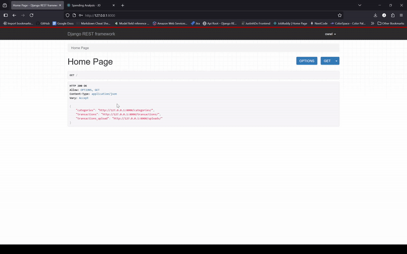

# Spending Analysis Frontend 

## Simple UI 

Intutive and straight-forward UI for file uploads, saving reports + generating summaries...

## React Bootstrap

**Creating React App**
`npm create-react-app spending_analysis`

**Installing React Bootstrap**
`npm install react-bootstrap bootstrap`

## Color Scheme 

- Navbar Focus: #f8f9fb
- Primary Variant: #565f6e
- Secondary Variant: #a2acbd

## Development 

**07/14/25**
- Spending Analysis Navbar + Home Page 
- Clear Description on what Spending Analysis is for (tracking expenditure)
- Report Submission File Upload (CSV only)
- Report Summary Component (props + generated after submission)
- Routers?
  - `npm install react-router-dom`
  - Router, Routes, Route in `App.js` with all the components as elements
  - Used `Link` in Navbar to bind our `Nav.Link` to Routes 

Result: Simple UI for CSV File Submission + Single Summary Componeent all with routes. 

**07/15/25**
- Reports Table to display all uploaded files
- Summary Button to open Modal 
- Displays Tabs with **Specific Details**, **Top 5 Vendors** **Spending per Category & Vendor**
  
Result: Reports table with Summary modal to display summary information based on file.